# AI Powered Clinical Appointment Booking System

## Mobile App Screens Pictures

<table>
  <tr>
    <td>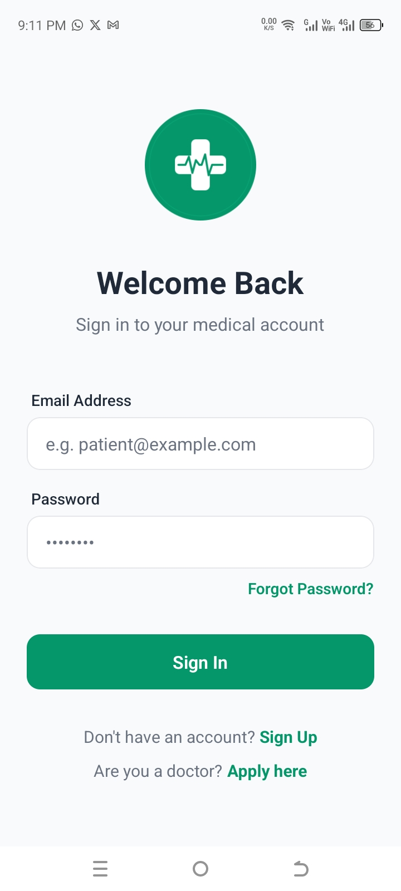</td>
    <td>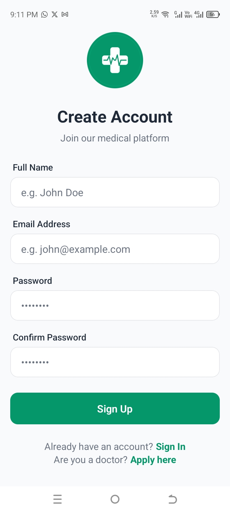</td>
  </tr>
  <tr>
    <td>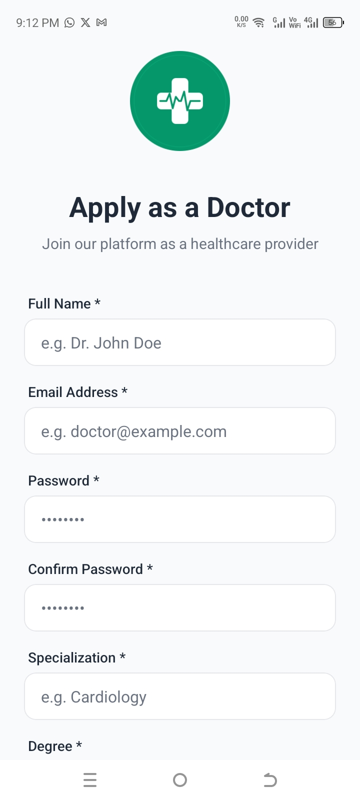</td>
    <td>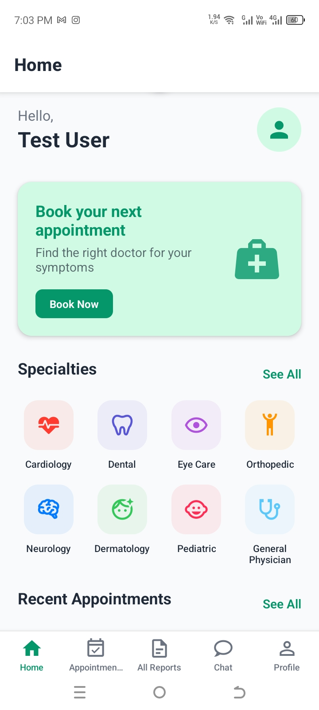</td>
  </tr>
  <tr>
    <td>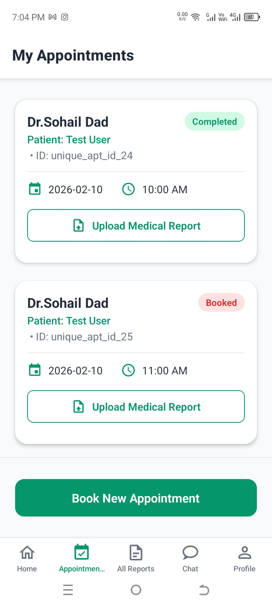</td>
    <td>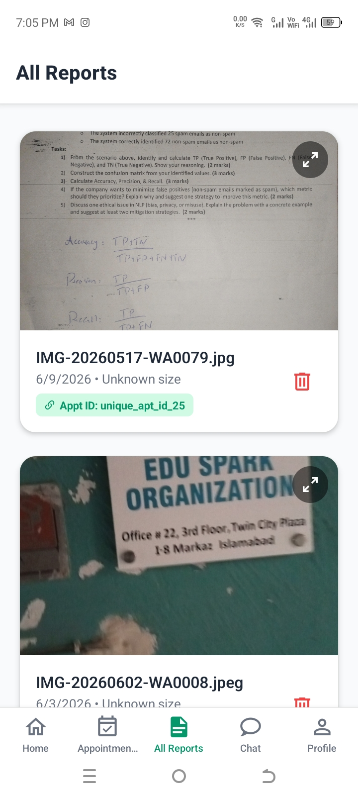</td>
  </tr>
  <tr>
    <td>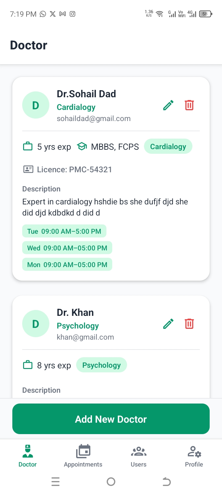</td>
    <td>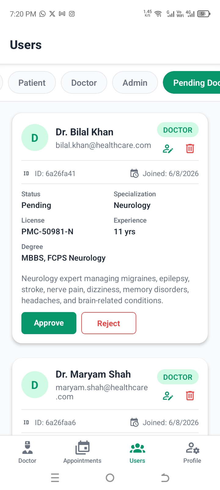</td>
  </tr>
  <tr>
    <td>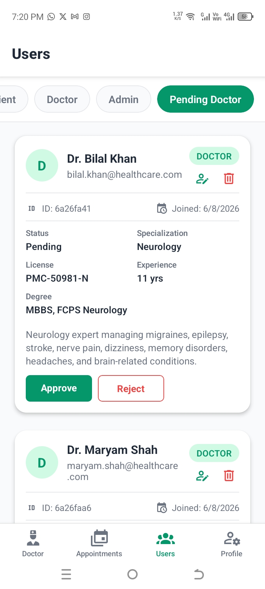</td>
    <td>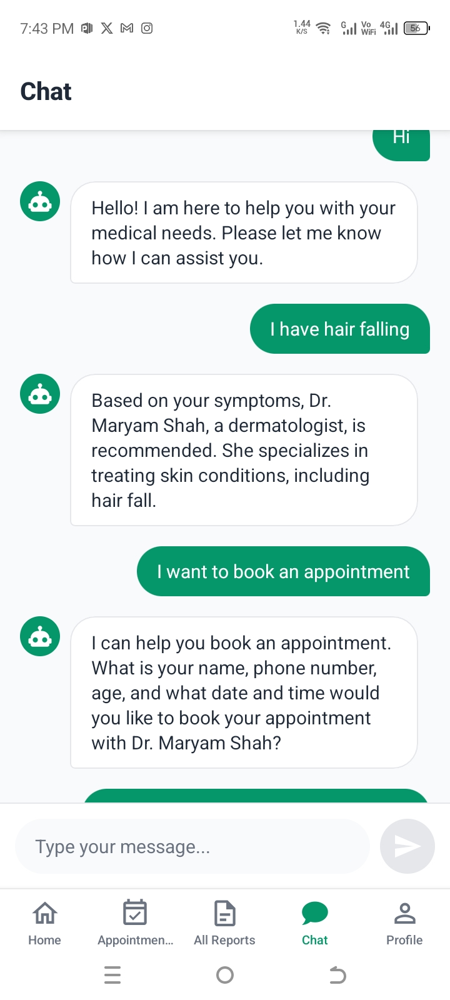</td>
  </tr>
  <tr>
    <td>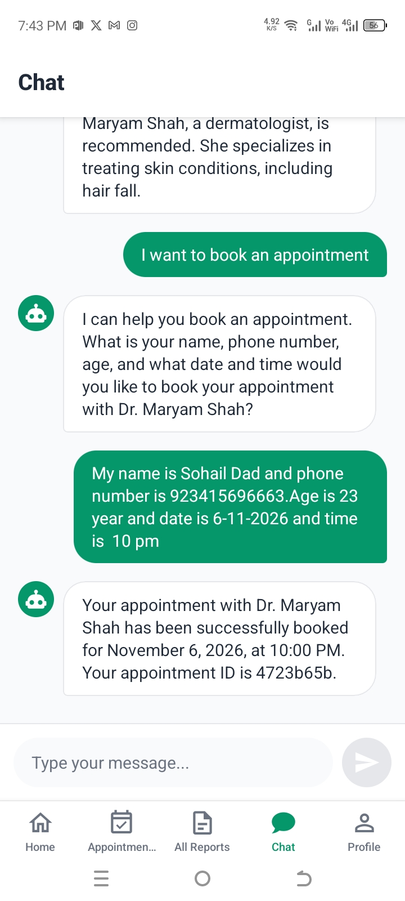</td>
    <td>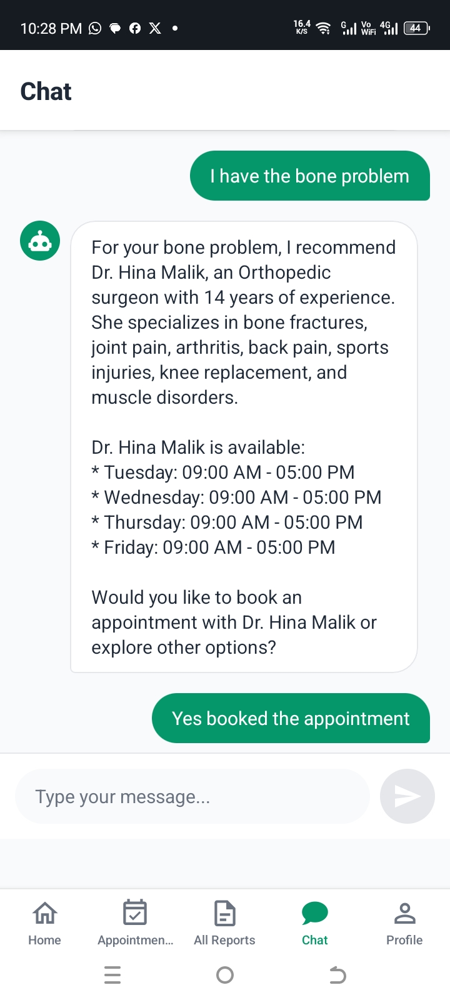</td>
  </tr>
  <tr>
    <td>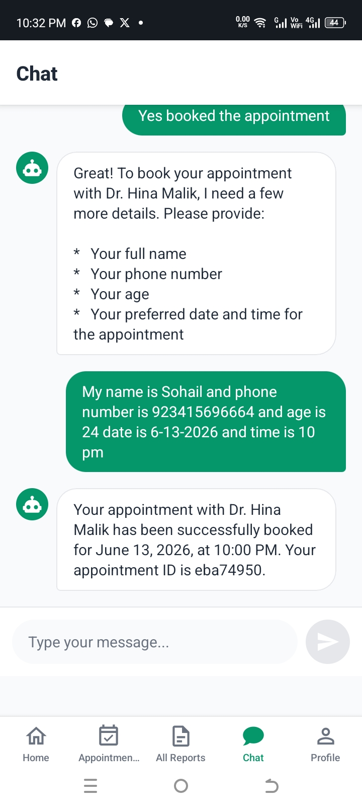</td>
    <td>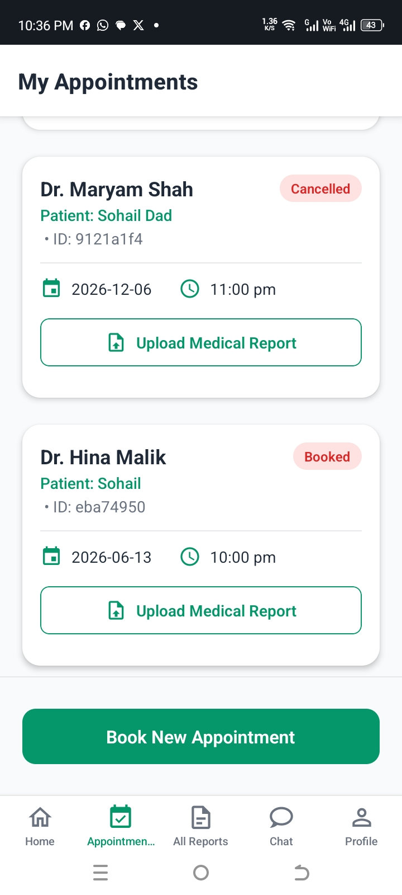</td>
  </tr>
  <tr>
    <td>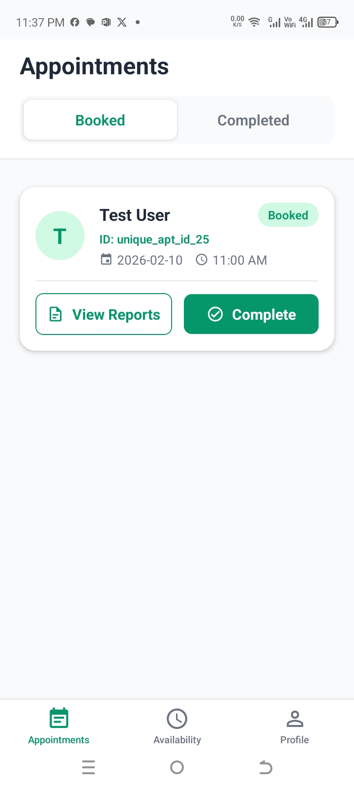</td>
    <td>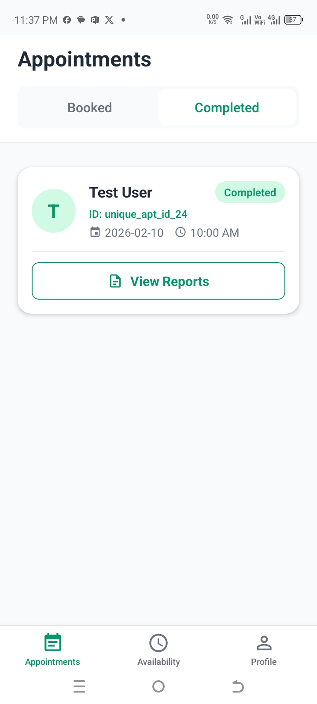</td>
  </tr>
  <tr>
    <td>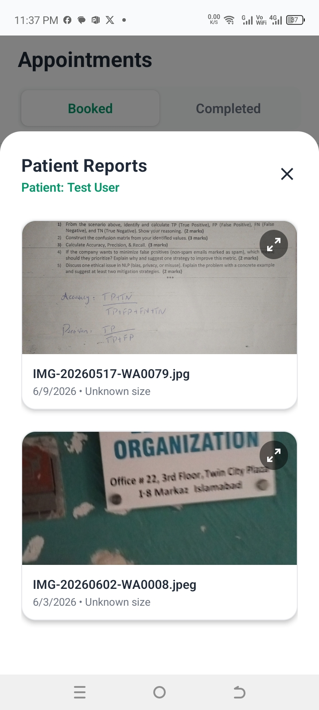</td>
    <td>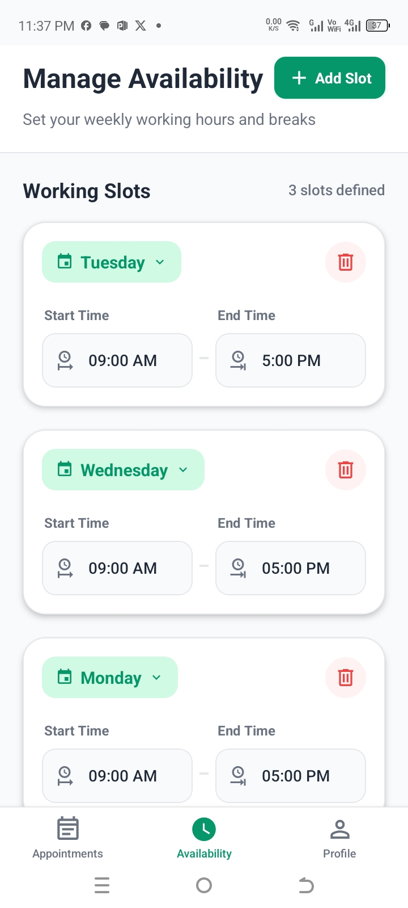</td>
  </tr>
  <tr>
    <td></td>
    <td>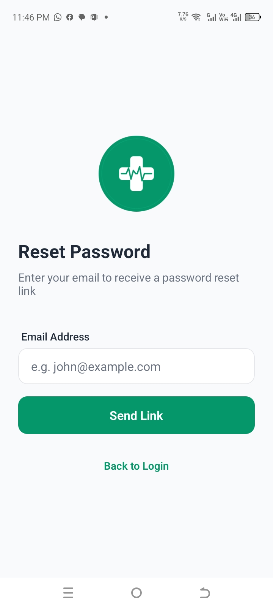</td>
  </tr>
</table>


## Project Overview

The AI Powered Clinical Appointment Booking System is a smart healthcare application that allows users to interact with an AI chatbot by describing their symptoms. The AI analyzes the symptoms, suggests relevant doctors or specialists, and helps users book, manage, and schedule medical appointments easily and efficiently.


The project consists of:

* React Native (Expo) Frontend
* NestJS Backend
* Python FastAPI + LangGraph AI Server

---

# Frontend Setup

## Navigate to Frontend Directory

```bash
cd frontend/app
```

## Run the Frontend Application

```bash
npx expo start
```

---

# NestJS Backend Setup

## Navigate to Backend Directory

```bash
cd backendNestjs
```

## Run the NestJS Backend Server

```bash
npm run dev
```

---

# Python AI Server Setup

## Navigate to Chatbot Directory

```bash
cd chatbot-langgraph
```

---

## Create Virtual Environment

```bash
python -m venv venv
```

---

## Activate Virtual Environment

### Windows

```bash
venv\Scripts\activate
```

### macOS/Linux

```bash
source venv/bin/activate
```

---

## Install Required Packages

```bash
pip install -r requirements.txt
```

---

## Run FastAPI Server

```bash
uvicorn fastapi_server:app --reload
```

---

# Technologies Used

* LangGraph
* FastAPI
* NestJS
* React Native
* Expo
* Python
* TypeScript

---

# Features

* AI-powered medical appointment booking
* Intelligent chatbot for symptom analysis
* AI-based doctor recommendation system
* Appointment scheduling and management
* Secure login and signup system
* Patient medical report upload functionality
* FastAPI-based AI processing server
* Mobile-friendly user interface using React Native
* Separate dashboards/modules for:

  * Patient
  * Doctor
  * Admin
* Real-time interaction between frontend and AI backend


---

# Development Notes

* Make sure Node.js and Python are installed.
* Run all servers separately for full system functionality.
* Configure environment variables before running the application.
* Activate the Python virtual environment before starting the FastAPI server.
